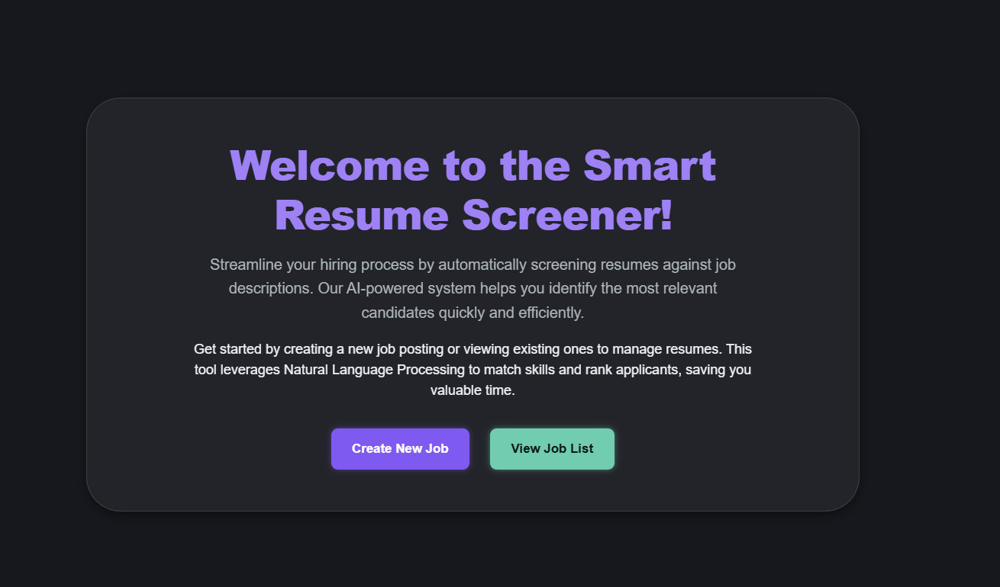
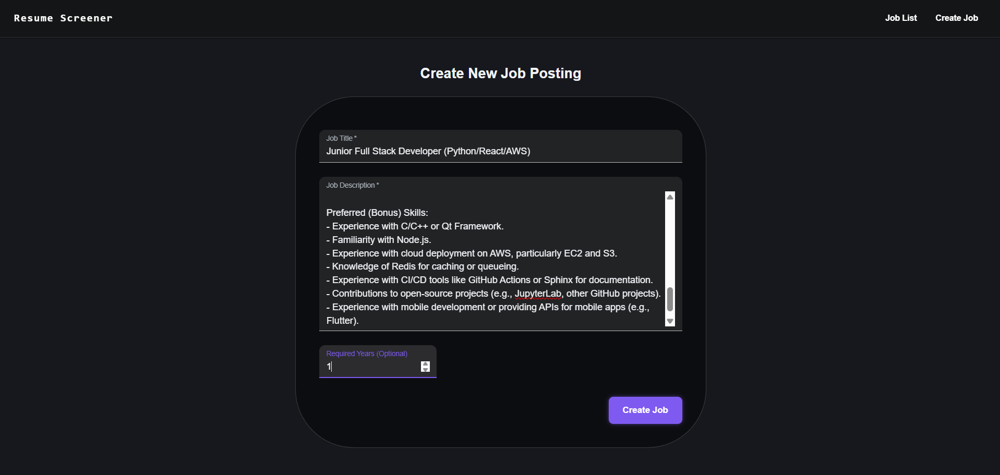
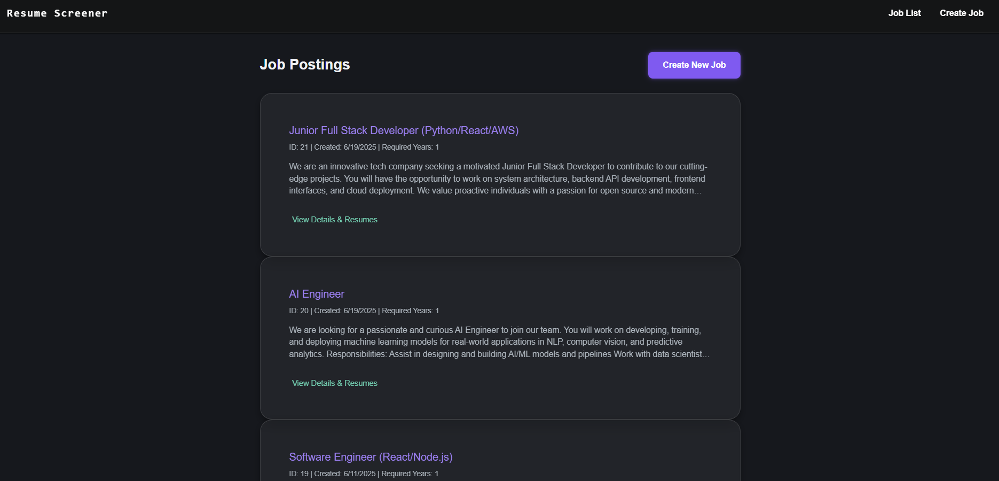
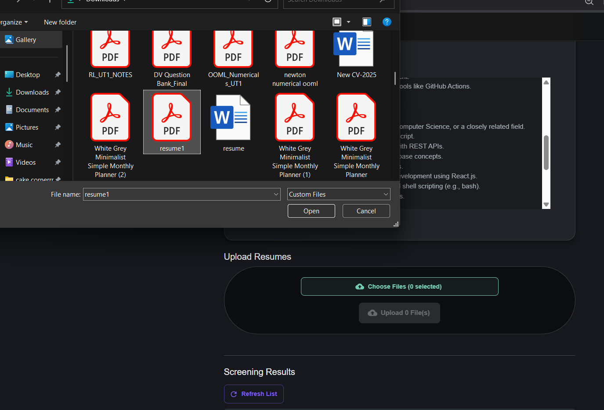
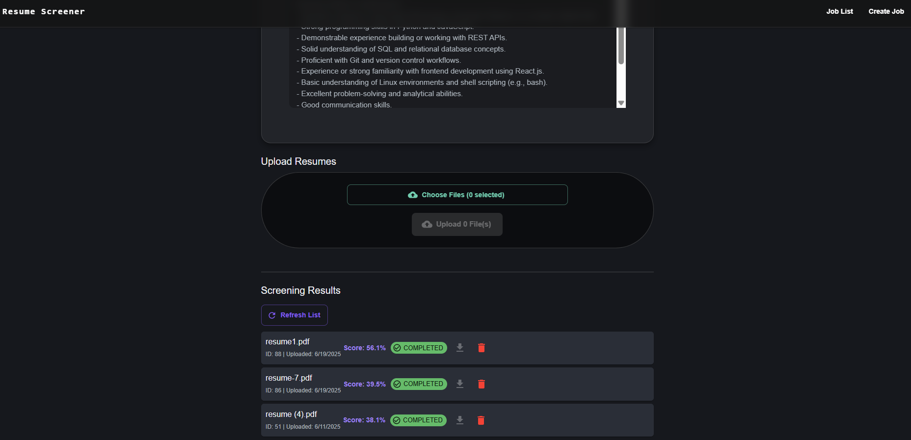

🧠 Smart Resume Screener

An intelligent, AI-powered web application that automatically screens resumes against job descriptions using Natural Language Processing (NLP). Designed to simplify and speed up the recruitment process for HR professionals.

 🚀 Features

- 🔍 **Resume Analysis using NLP**  
- 🧠 Skill, Experience, and Semantic Matching  
- ⚡ Real-time Resume Upload & Processing  
- 📥 Resume File Management (upload/download/delete)  
- 🎛 Job Post Management (create, list, view)  
- 🖥️ Modern UI with Responsive Design  
- 🔄 Background Processing with Celery  

 🧱 Tech Stack

 🧩 Backend

- Python + Flask (REST API)
- PostgreSQL (Data Storage)
- Celery + Redis (Asynchronous Resume Processing)
- NLP Tools:
  - `spaCy`, `regex`, `dateparser`, `TF-IDF`
  - Optional: `Sentence-Transformer` (semantic match)

 🖼 Frontend

- React + Vite
- Material UI (Dark Themed UI)
- Axios (API Communication)
- React Router (Routing)

---

## 📂 Project Structure

smart-resume-screener/
├── backend/
│ ├── app/
│ │ ├── models.py # SQLAlchemy models for Jobs and Resumes
│ │ ├── routes.py # Flask API routes
│ │ ├── utils/
│ │ │ ├── nlp.py # Resume parsing and scoring logic
│ │ │ ├── parsers.py # File format parsing (PDF/DOCX)
│ │ └── tasks.py # Celery worker logic
│ ├── config.py # Environment & config management
│ ├── run.py # Flask app entrypoint
│ └── celery_worker.py # Celery worker entrypoint
│
├── frontend/
│ ├── src/
│ │ ├── pages/
│ │ │ ├── HomePage.jsx
│ │ │ ├── JobListPage.jsx
│ │ │ ├── CreateJobPage.jsx
│ │ │ └── JobDetailPage.jsx
│ │ ├── components/
│ │ │ ├── ResumeUpload.jsx
│ │ │ └── ResumeList.jsx
│ │ ├── App.jsx
│ │ ├── apiService.js
│ └── main.jsx
│
└── README.md

yaml
Copy
Edit

---

 🛠️ Installation & Setup

 📦 Backend

bash
cd backend
python -m venv venv
source venv/bin/activate  # or venv\Scripts\activate on Windows

pip install -r requirements.txt
flask db upgrade  # Set up PostgreSQL tables
celery -A app.tasks.celery worker --loglevel=info  # Run Celery Worker

python run.py  # Start Flask API
🌐 Frontend
bash
Copy
Edit
cd frontend
npm install
npm run dev
🔗 API Endpoints
Method	Endpoint	Description
GET	/api/jobs	Get all job postings
POST	/api/jobs	Create a new job post
GET	/api/jobs/:id	Get job details
POST	/api/jobs/:id/resumes	Upload resume for job
GET	/api/jobs/:id/resumes	Get all resumes for a job
GET	/api/resumes/:id/download	Download resume file
DELETE	/api/resumes/:id	Delete a resume

🧠 How Scoring Works (NLP Pipeline)
Skill Score: Matches keywords from JD and resume

Experience Score: Extracts durations using regex + dateparser

Semantic Score : Embedding similarity via Sentence Transformers

Final Score: Weighted combination of all

📸 Screenshots
 🏠 Home Page

 📋 Job Create

 📋 Job List

 📄 Upload Resume

 📄 Resume Score

📈 Future Improvements: 

📊 authorization login (ongoing)
📊 Admin Dashboard
📊More refining scoring of resume
🎨 UI/UX Improvements
Improve mobile responsiveness, accessibility, and visual polish.
☁️ Cloud Deployment
Deploy on AWS/GCP with CI/CD pipeline and production-ready scaling.

🧑‍💻 Author
Made by Shubham Kumavat

